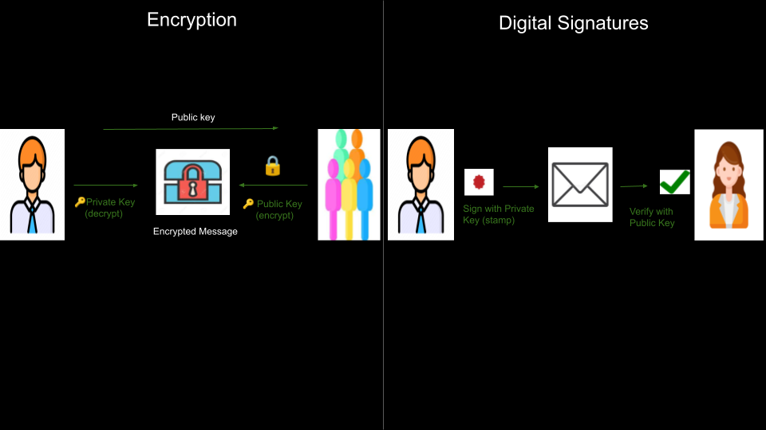

# Sidepit Cryptography Tutorial



## What is Cryptography?

Cryptography is the practice of developing and using **coded algorithms** to 
protect and obscure transmitted information through **encryption** such that 
it may only be read by those with the permission and ability to **decrypt** it. 

Cryptography is critical in many fields to secure communications and protect data. 
It is commonly used to secure websites (SSL), and **blockchain**.

#### Key concepts in cryptography include:

- **Encryption:** Transforming readable data into an unreadable form.
- **Decryption:** Converting the unreadable form back into its original, readable form.
- **Public/private keys:** Unique values used to encrypt and decrypt information.

#### The padlock analogy

Encryption is like locking a box with a padlock. Anyone can lock the box using a **public key**, 
but only the person with the **private key** can unlock it and read what's inside.

**Cryptography serves as the foundation for secure digital communication and data protection.**

## Getting Started

### 1. Clone the Repository and Navigate into It

```sh
git clone https://github.com/sidepit/101--cryptography.git
cd 101--cryptography
```

### 2. Create a Virtual Environment

```sh
python -m venv .yourenv
```

### 3. Activate the Virtual Environment

**Windows:**
```sh
.yourenv\Scripts\activate
```

**Mac/Linux:**
```sh
source .yourenv/bin/activate
```

### 4. Install Necessary Packages 

```sh
pip install secp256k1
pip install ecdsa
pip install base58
```
### 5. Install OpenSSL

**Mac:** OpenSSL is pre-installed.

**Linux:**

```sh
sudo apt install openssl
```

**Explore specific cryptographic technologies and methods below:**

- [SSL](readmes/ssl.md)
- [ECDSA](readmes/ecdsa.md)
- [SECP256K1](readmes/secp256k1.md)