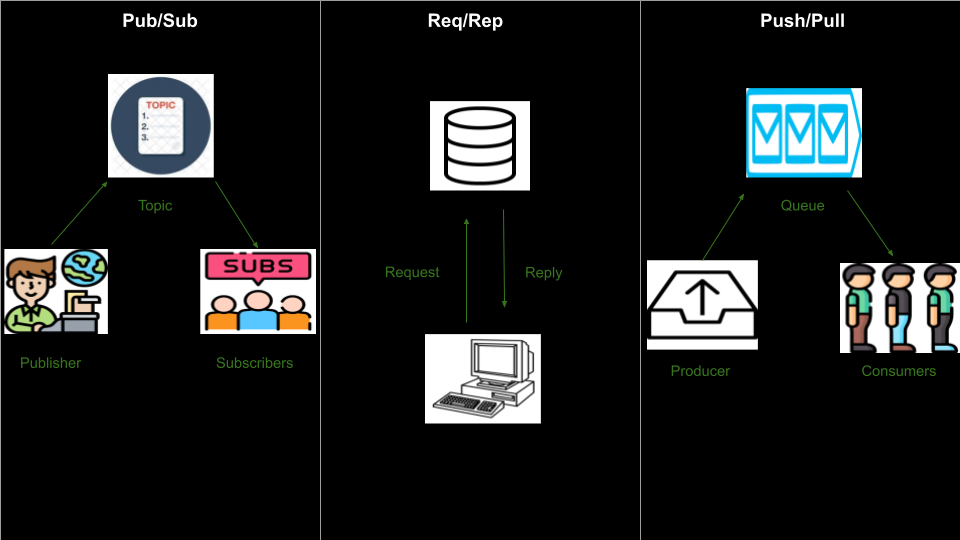

# Sidepit NNG communication protocols



## Getting Started

### 1. Navigate to education/nng

```sh
cd education/nng
```

### 2. Create a Virtual Environment

```sh
python -m venv .env
```

### 3. Activate the Virtual Environment

**Windows:**
```sh
.env\Scripts\activate
```

**Mac/Linux:**
```sh
source .env/bin/activate
```

### 4. Install pynng
```sh
pip install pynng
```

### 5. Install nngcat

**Mac**
```sh
brew install nng
```

**Linux**
```sh
sudo apt-get install nng
```

### 6. Navigate to the Desired Communication Folder

To navigate into a specific communication protocol folder, use one of the following commands:

```sh
cd pubsub
```

```sh
cd pushpull
```

```sh
cd reqrep
```

### 7. Test the Protocol

Open two terminal windows and run the appropriate file in each one.

## What is Pub/Sub?

Pub/Sub (Publish/Subscribe) is a messaging pattern where a publisher sends messages to specific **topics**, 
and subscribers who have subscribed to those topics receive the messages.

### Example Code in Python

```python
# pubsub/publisher.py
import pynng
import time

with pynng.Pub0() as pub:
    pub.listen("tcp://127.0.0.1:5001")
    while True:
        pub.send(b"Hello, world!")
        time.sleep(1)

# pubsub/subscriber.py
import pynng

with pynng.Sub0() as sub:
    sub.dial("tcp://127.0.0.1:5001")
    sub.subscribe(b"")
    while True:
        message = sub.recv()
        print(f"Received: {message.decode()}")
```

### Example Using The Command Line

```sh
# In one terminal
nngcat --pub --listen tcp://127.0.0.1:5001 --data "cuckoo" --interval 1

# In another terminal
nngcat --sub --dial tcp://127.0.0.1:5001 --quoted
```

## What is Req/Rep?

Req/Rep (Request/Reply) is a messaging pattern where a **client** sends a request to a **server**, and the server 
processes the request and sends back a reply. 

### Example Code in Python

```python
# reqrep/request.py
import pynng
import time

with pynng.Req0() as req:
    req.dial("tcp://127.0.0.1:5001")
    while True:
        req.send(b"Send me a message...")
        reply = req.recv()
        print(reply.decode())
        time.sleep(1)

# reqrep/reply.py
import pynng

with pynng.Rep0() as rep:
    rep.listen("tcp://127.0.0.1:5001")
    while True:
        received_message = rep.recv()
        print(received_message.decode())
        rep.send(b"Message: Hello, world!")
```

### Example Using The Command Line

```sh
# In one terminal
nngcat --req --dial tcp://127.0.0.1:5001 --data "what is the answer?" --quoted  

# In another terminal
nngcat --rep --listen tcp://127.0.0.1:5001 --data "42" --quoted                                                     
```

## What is Push/Pull?

Push/Pull is a messaging pattern often used for task distribution where a **producer** (or **pusher**) sends messages 
(tasks or jobs) to **workers** (or **pullers**). The workers pull these messages and process them. 

### Example Code in Python

```python
# pushpull/push.py
import pynng

with pynng.Push0() as push:
    push.listen("tcp://127.0.0.1:5001")
    while True:
        push.send(b"Hello from push")

# pushpull/pull.py
import pynng
import time

with pynng.Pull0() as pull:
    pull.dial("tcp://127.0.0.1:5001")
    while True:
        received_message = pull.recv()
        print(received_message.decode())
        time.sleep(1)
```

### Example Using The Command Line

```sh
# In one terminal
nngcat --pull --dial tcp://127.0.0.1:5001 --quoted

# In another terminal
nngcat --push --listen tcp://127.0.0.1:5001 --data "Here is a job for you..."                                                   
```

## Common Functions

- **listen()**: Opens a socket to **listen** for incoming connections or messages. 
- **dial()**: Initiates a connection to a remote socket by **dialing** to it. 
- **subscribe()**: Subscribes to messages from a specific set of topics. **Used by subscribers in a Pub/Sub pattern only**.
- **send()**: Sends a message through the socket to the connected peer.
- **recv()**: Receives a message from the connected peer.
- **decode()**: Converts the received message from a binary format into a string or other usable format. 

For a complete list of methods, please visit the [pynng documentation](https://pynng.readthedocs.io/en/latest/core.html) and the [nngcat command line methods](https://www.mankier.com/1/nngcat).