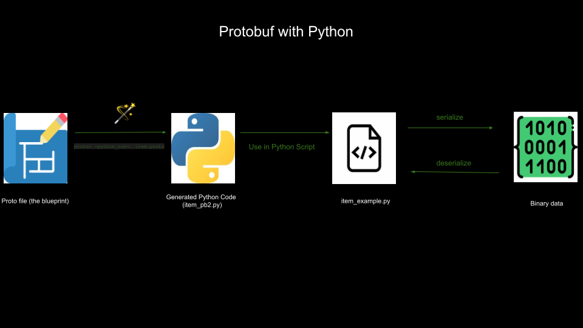

# Sidepit Protobuf Tutorial



## Overview

### What is Protobuf:

**Protobuf (Protocol Buffers)** is a **data format** developed by Google that allows developers to 
serialize structured data across platforms. It’s often used to store data or enable programs 
to communicate over a network.

### What is Serialization:

Serialization converts data into a format for storage or transmission

### Common Uses:

- **APIs:** Protobuf is used to transmit data between applications and services.
- **Data storage:** Protobuf's compact binary format is ideal for storing structured data.
- **Microservices:** Protobuf helps services communicate quickly.

### Equivalent Common Technologies:

- JSON
- XML

### Field Numbers — Compatibility:

In Protobuf, each field in a message has a **unique field number**. Older systems can ignore unknown 
fields while still understanding known fields, maintaining backward and forward compatibility.

### Language-Neutral:

The .proto file is **language-neutral**, it can be compiled into various programming languages (e.g., Python, Ruby, Java).

### Cross-Language:

Protobuf is **cross-language**, meaning it allows data to be serialized in one language and deserialized in another.

## Python Demo

### 1. Navigate to `education/protobuf`

```sh
cd education/protobuf
```

### 2. Create a Virtual Environment

```sh
python -m venv .env
```

### 3. Activate the Virtual Environment

**Windows:**
```sh
.env\Scripts\activate
```

**Mac/Linux:**
```sh
source .env/bin/activate
```

### 4. Install the Protobuf Compiler

**Mac**
```sh
brew install protobuf
```

**Linux**
```sh
sudo apt-get install protobuf-compiler
```

### 5. Install the Protobuf Python Package

```sh
pip install protobuf
```

**Potential Proto Version Compatibility Issues**

Be aware of potential **proto version compatibility issues** between the python package and the 
proto version installed via brew or linux. Ensure that **both versions are compatible** to avoid issues.

### 6. Navigate into the Proto Folder.

```sh
cd proto
```

### 7. Review the Files and Their Information

1. **Open the `item.proto` file:**

    ```proto
    syntax = "proto3";

    message Item {
        int32 id = 1;
        string name = 2;
        string rating = 3;
        bool in_stock = 4;
    }
    ```

    *This file defines the structure of our protobuf messages.*

2. **Generate a `pb2` file from the proto file:**

    Compile the protobuf into the equivalent python

    ```sh
    protoc --python_out=. item.proto
    ```

    Check and validate the proto syntax with the following command

    ```sh
    protoc --proto_path=. --descriptor_set_out=/dev/null item.proto
    ```

    (If the syntax is valid, nothing will be printed)

3. **Open the `item_example.py` file:**

    *This file demonstrates how to create, serialize, and deserialize a protobuf message.*

    ```python
    # proto/item_example.py
    from google.protobuf.json_format import MessageToJson
    import item_pb2

    item = item_pb2.Item()

    item.id = 1
    item.name = "Flashlight 🔦"
    item.rating = "⭐️⭐️⭐️"
    item.in_stock = True

    data_serialized = item.SerializeToString()

    item.ParseFromString(data_serialized)

    print(f"Id: {item.id}")
    print(f"Name: {item.name}")
    print(f"Rating: {item.rating}")
    print(f"In Stock: {item.in_stock}")

    # Convert Protobuf to JSON!
    print("JSON Output:")
    print(MessageToJson(item, indent=2))
    ```

4. **Run the file:**

    Execute the following command:

    ```sh
    python item_example.py
    ```
    
    **If all goes correctly you should see the following output in your terminal:**

    ```text
    Id: 1
    Name: Flashlight 🔦
    Rating: ⭐️⭐️⭐️
    In Stock: True
    JSON Output:
    {
        "id": 1,
        "name": "Flashlight \ud83d\udd26",
        "rating": "\u2b50\ufe0f\u2b50\ufe0f\u2b50\ufe0f",
        "inStock": true
    }
    ```

For more info on protobuf in python, please visit the 
[protobuf documentation for python](https://protobuf.dev/getting-started/pythontutorial/).